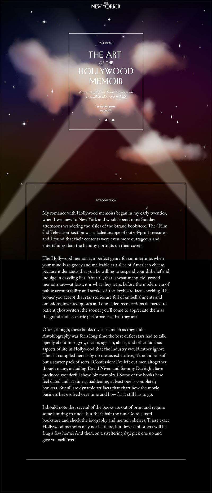
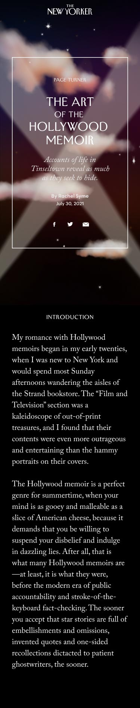

# Assignment for the Interactive Designer

Modify the index.html and style.css files in the [designer directory](https://github.com/CondeNast/tnyint-technical-test/tree/master/assigments/designer) to create the following layouts: 

| Desktop | Mobile |
| ------- | ------ |
|  |  |

Use the Figma file sent to you in the assignment instructions email for further specification of the layout requirements. 

### Requirements
* Must use semantic HTML
* Must be responsive across the breakpoints provided in Figma.
* Must use web-ready assets. This [zip file](https://downloads.newyorker.com/tnyint-code-test/designer-code-test-assets.zip) will contain all the assets required for the assignment
* Commit your assets in the repo and use relative paths in your HTML.
* Use [this text file](../assigments/designer/text.md) for all copy

You may use basic CSS or a precompiler

### Optional Tasks

**_These tasks are optional and are not required for a candidate's test to be reviewed._** If time permits, candidates can attempt to add any of the following:

* Animate the searchlights, [following this prototype](https://downloads.newyorker.com/tnyint-code-test/hero-animation.mp4). The lights should loop infinitely. 
* Animate the stars in the background so that they twinkle
